 # Flexbox
>This is a practice repo for flexbox and exercises based on it

> A good guide for flex box is the [css tricks flexbox snippets](https://css-tricks.com/snippets/css/a-guide-to-flexbox/)

 We can use an emmet shortcut to do this
`.container>.box.box1*10`
- We are using `normailize.css` which resets the default browser settings to make  our code have the same look across browsers
- without flexbox the elements i.e. div tags are stacked on top of each other
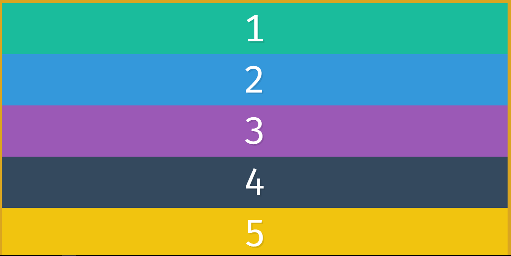
- To start using flexbox we simply have to write `display:flex` on the parent container
using flex we get and our flex container goes all the way across

inline-flex will just wrap around the content

- The parent container is called the **flex container** and the immediate children are called **flex items** and we dont explicitly need to define display flex on the children

### flex-direction
- In flexbox we have main and cross axis
- `flex-direction:row` is the default value and it goes from left to right 
- `flex-direction:column`stacks from top to bottom
- The min-height property in CSS is used to set the minimum height of a specified element. The min-height property always overrides both height and max-height
- When we use flex-direction  we get two axises : _main axis and cross axis_
Below is the depiction for main and cross axis when using `flex-direction:row`

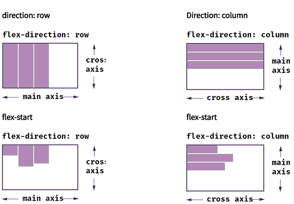

### flex-wrapping
- flex-wrap is put on the flex-container(parent) and not flex-item(immediate children)
- It's default value is `flex-wrap:nowrap`
- default flex items take the height of the element .and strtches to fit it
- To divide the screen into equal space for divs to avoid whitespace we  can use `100/3 viz 33.3333%` or just use calc() `width:calc(100% / 3);`
- if we put `flex-direction:column` and have a 100vh and wrap is set, it  wraps the elements within the screen space
- If we set height to min-height it will wrap cause min-height is set and height is not fixed

_without min-height and with in-height:_
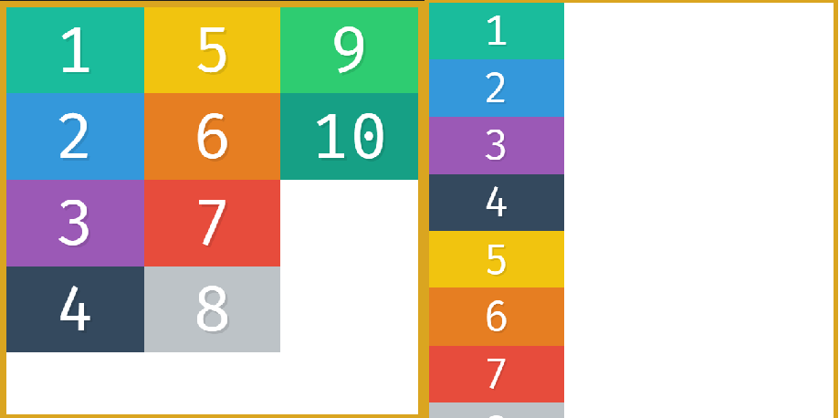

if we want to add margin then we can do 
`width:calc(33.3333% - 20px);` 20px cause 10px on either side left & right
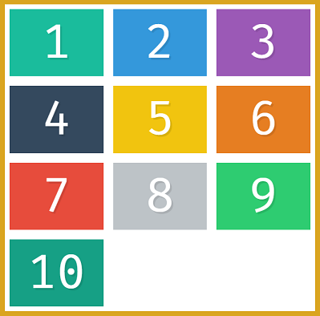

### flex-ordering
- `flex:1;` takes the width and evenly spreads it 
- We can set it on the `flex-items`,by default all are set to _zero_
`.box{order:0}` and when we do `.box{order:2}` it sets it at the end of last element with `order:0`
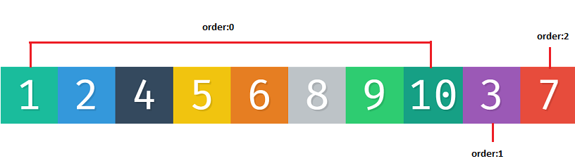

Also works with negative values .box3`{order:-1}`
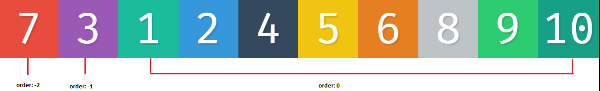
- not to be used to copy texts but only to order certain elements

### Flex-alignment content with justify-content
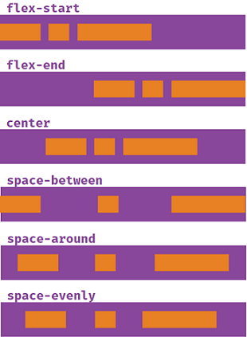
- `justify content` is used to describe how the items are aligned on the main axis

below is for `flex-direction:column` with _main axis running from top to bottom_

### Flex-alignment conent with align items
  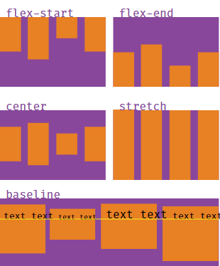
- for align items we are more concerned about the cross axis which is from top to bottom
- align items are set to stretch by default
`align-items:stretch`
- baseline aligns items according to their text baseline

### Flex-alignment with align-self
  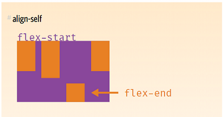

- This allows the default alignment to be overridden by invidual flex items
- **Note** that float, clear and vertical-align have no effect on a flex item.
  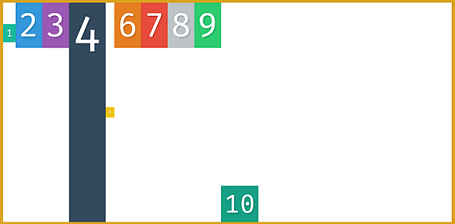

### Flex sizing property
- the `flex items` have flex as `auto`
- so when we say `flex:1` it takes up the remaining space and distributes the space evenly for all 
  

### Flexbox flex-grow,flex-shrink,flex-basis
**The beauty of flex items is being “flexible.”**
  ####Flex-grow and Flex-shrink
Flex-grow and flex-shrink allow us to play around this even more
- The flex-grow and flex-shrink properties _control how much a flex-item should “grow” (extend) if there are extra spaces_, **or** _“shrink” if there are no extra spaces._
- **They may take up any values ranging from 0 to any positive number. 0 || positive number**
- **By default, the flex-grow property is set to 0**. By implication, the flex-item does NOT grow to fit the entire space available.
- **By default, the shrink property is set to 1.** Which means the flex-shrink switch is also turned on!
- when we set `flex:1` its a shorthand for `flex-grow:1` and `flex-shrink:1`
- # **TLDR;** flex grow deals with how to manage extra space while flex shrink deals with how to slim ourselves down when we dont have extra space(i.e. how much of ourselves to give up in proportion to the other one )
  #### Flex-basis
- **The flex-basis property specifies the initial size of a flex-item**. _Before the flex-grow or flex-shrink properties adjust it's size to fit the container or not._
- The default value is `flex-basis: auto`. Flex-basis can take on any values `percentages || ems || rems || pixels etc`

### Flex Shorthand
- The flex shorthand allows you set the flex-grow, flex-shrink and flex-basis properties all at once.

` li {
  flex: 0 1 auto;
}`
- The code above is equal to setting the three properties: **flex-grow: 0; flex-shrink: 1; flex-basis: auto**
- ## **Flex-grow first, then flex-shrink, and then flex-basis. The acronym, GSB**
  
  - the shorthand property is the recommended way
 ### Navbar
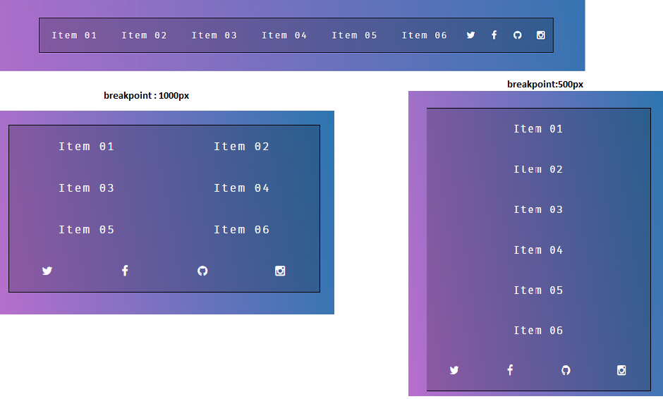